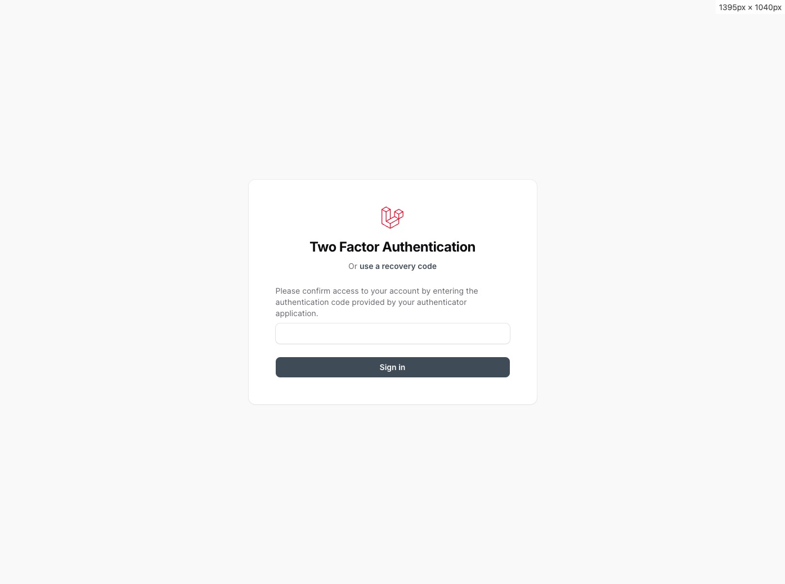
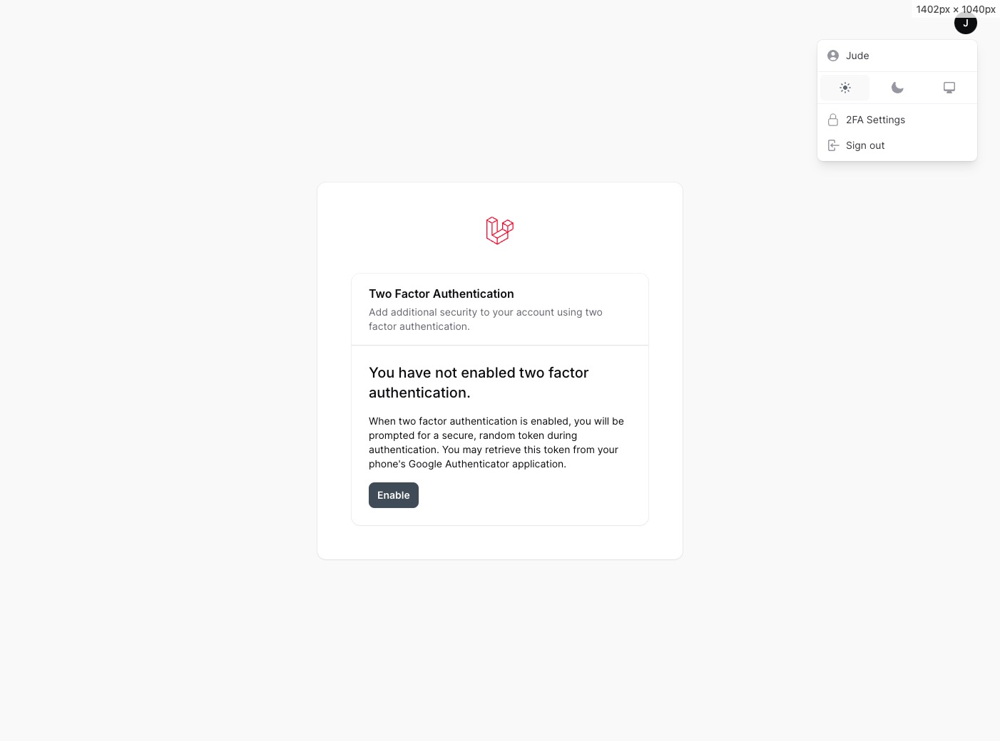
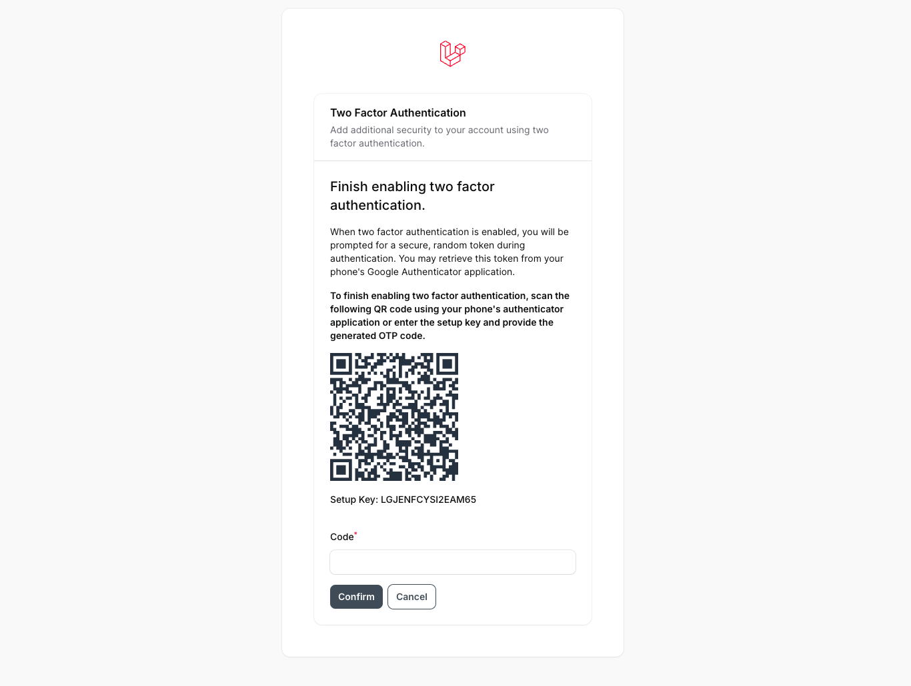
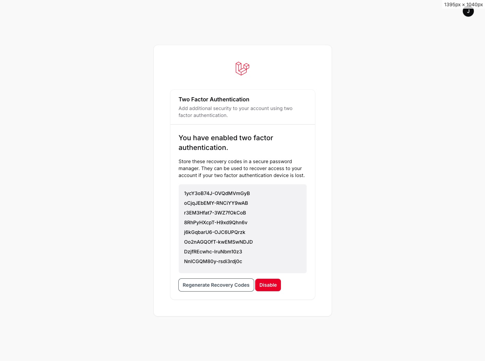

# Filament Two Factor Authentication

[//]: # ([![Latest Version on Packagist]&#40;https://img.shields.io/packagist/v/stephenjude/filament-two-factor-authentication.svg?style=flat-square&#41;]&#40;https://packagist.org/packages/stephenjude/filament-two-factor-authentication&#41;)
[](https://github.com/stephenjude/filament-two-factor-authentication/actions?query=workflow%3Arun-tests+branch%3Amain)
[](https://github.com/stephenjude/filament-two-factor-authentication/actions?query=workflow%3A"Fix+PHP+code+styling"+branch%3Amain)
[](https://packagist.org/packages/stephenjude/filament-two-factor-authentication)

This plugin adds 2FA authentication to your Filament application. This package can be added both to new and existing Filament (V3) applications.

## Features

- Supports Google 2FA Authenticator and recovery codes.
- Configurable plugin API for enforcing 2FA.
- Configurable plugin API for adding 2FA Settings to user menu item.
- Extendable 2FA settings component for custom pages.
- Automated test for all pages and components.

## Usage
First, ensure that your application's authenticatio model uses the `TwoFactorAuthenticatable` trait:

```php
namespace App\Models;
...
use Stephenjude\FilamentTwoFactorAuthentication\TwoFactorAuthenticatable;

class User extends Authenticatable implements FilamentUser
{
    ...
    use TwoFactorAuthenticatable;
```

Add two factor authentication plugin to a panel by instantiating the plugin class and passing it to the plugin() method
of the configuration:

```php
...
use Stephenjude\FilamentTwoFactorAuthentication\TwoFactorAuthenticationPlugin;
 
public function panel(Panel $panel): Panel
{
    return $panel
        ->plugins([
            TwoFactorAuthenticationPlugin::make()
                    ->addTwoFactorMenuItem() // Add 2FA settings to user menu items
                    ->enforceTwoFactorSetup() // Enforce 2FA setup for all users
        ])
}
...
```

## Installation

Thank you for purchasing Filament Two Factor Authentication Plugin!

Below, you'll find documentation on installing this plugin. If you have any questions, find a bug, need support, or have
a feature request, please don't hesitate to reach out to me at stephenjudesuccess@gmail.com.

You can install the package via composer:

```bash
composer require stephenjude/filament-two-factor-authentication
```

Install the plugin migration using:
```bash
php artisan filament-two-factor-authentication::install
```

Optionally, you can publish the views using
```bash
php artisan vendor:publish --tag="filament-two-factor-authentication-views"
```

## Screenshot

#### 2FA Authentication


#### 2FA Recovery


#### 2FA Disabled


#### 2FA Setup 


#### 2FA Enabled (Recovery Codes)


## Testing

```bash
composer test
```

## Changelog

Please see [CHANGELOG](CHANGELOG.md) for more information on what has changed recently.

## Contributing

Please see [CONTRIBUTING](.github/CONTRIBUTING.md) for details.

## Security Vulnerabilities

Please review [our security policy](../../security/policy) on how to report security vulnerabilities.

## Credits

- [stephenjude](https://github.com/stephenjude)
- [All Contributors](../../contributors)

## License

The MIT License (MIT). Please see [License File](LICENSE.md) for more information.
